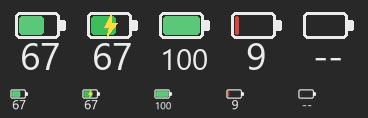

# Keyboard Companion

> **For now: Keychron K10 HE only.**

A small, extensible companion app for Keychron keyboards.

It ships with a Windows **tray** utility that shows the keyboard's battery level
(the keyboard must run the modified QMK firmware with the custom raw-HID battery
channel, command `0xA4`). Battery reading works over **all three connections**:
- **USB cable** — raw-HID pull,
- **2.4 GHz dongle** — raw-HID push (firmware sends the battery on its own),
- **Bluetooth** — mirrors the battery level Windows already exposes (BLE Battery
  Service), since the vendor raw-HID channel is not available over BT.

It can also open the official Keychron launcher and exposes other customizable
options — and it's designed to grow beyond battery monitoring over time.

> Community project. **Not affiliated with or endorsed by Keychron.** The name
> refers to it being a companion app for your keyboard.
> The name is configurable in `keeb_assistant/__init__.py` (`APP_NAME`, `APP_ID`).

## Tray icon




The icon shows a battery glyph with the percentage below; the top row is the
full-size render, the bottom row simulates the size in the Windows tray.

## Features (v0.2)
- Tray icon with the **battery percentage** and color by level (green/amber/red).
- Tooltip + menu with **%, voltage, charging state, link type**.
- **Smoothing** (EMA + hysteresis) so the value does not flicker.
- **Low-battery notification** (configurable threshold).
- **Multi-language UI**: English / Italian / 中文, switchable at runtime and easy
  to extend (see `i18n.py`).
- **Settings window** (language, threshold, notifications, smoothing, autostart).
- **Open Launcher** menu entry that opens the official Keychron web launcher in
  your browser.
- **Optional** start-with-Windows, toggleable from the menu or settings.
- Auto-reconnect when switching cable ⇄ dongle or powering the keyboard back on.

## Requirements
- A Keychron K10 HE flashed with QMK firmware modified to report battery over
  the custom raw-HID channel (command `0xA4`, plus the 2.4 GHz push model) —
  see the firmware repo
  **[k10he-battery-firmware](https://github.com/OutersSoftware/k10he-battery-firmware)**.
  Without that firmware there is no HID battery data over cable/dongle; the
  Bluetooth reading still works, since it mirrors what Windows already exposes.
- Python 3.9+ (only to run from source or to build the exe).

## Download (Windows)

Grab the latest version from the
[**Releases**](https://github.com/OutersSoftware/keyboard-companion/releases)
page, then just double-click it. The tray icon appears;
right-click it for the menu (or double-click the icon to open Settings).

> The battery reading over **cable / 2.4 GHz dongle** requires the modified QMK
> firmware (see [Requirements](#requirements)). The **Bluetooth** reading works
> out of the box, since it mirrors what Windows already reports.

Devs can run from source or rebuild the exe — see
[Run from source](#run-from-source) and [Build a single .exe](#build-a-single-exe).

## Run from source
```powershell
cd keeb_assistant
pip install -r requirements.txt
python -m keeb_assistant            # launch the tray app
python -m keeb_assistant --once     # print one reading and exit (debug)
```

## Build a single .exe
```powershell
cd keeb_assistant
.\build_exe.ps1            # produces dist\KeyboardCompanion.exe
```
The exe is self-contained (no Python needed). Double-click it; the tray icon
appears. Right-click → Quit to exit.

## Autostart (optional)
Off by default. Toggle it from the tray menu or the settings window. It simply
adds/removes an entry under `HKCU\Software\Microsoft\Windows\CurrentVersion\Run`.

## Configuration
JSON file at `%APPDATA%\KeyboardCompanion\config.json` (created on first run):
- `language` (`en` / `it` / `zh`)
- `smoothing_alpha` (0–1, lower = steadier/slower)
- `smoothing_deadband` (percentage points of hysteresis before the shown value moves)
- `low_battery_threshold` (% below which it notifies)
- `notify_low_battery` (true/false)
- `pull_interval_sec` (how often to poll in cable mode)

## Add a language
Edit `keeb_assistant/i18n.py`: add a dict to `TRANSLATIONS` and an entry to
`LANGUAGES`. Missing keys fall back to English automatically.

## Project layout
```
keeb_assistant/
  keeb_assistant/
    hid_reader.py       # unified HID read (dongle push + cable pull)
    ble_reader.py       # Bluetooth battery mirror (Windows PnP property)
    smoothing.py        # EMA + hysteresis
    icon.py             # battery icon drawing
    i18n.py             # translations (en/it/zh, extensible)
    config.py           # JSON config
    autostart.py        # Windows autostart (registry)
    settings_window.py  # Tk settings window
    tray_app.py         # tray app (pystray)
    __main__.py         # entry + CLI --once
  run_tray.py           # entry for running/packaging
  build_exe.ps1         # PyInstaller build
  requirements.txt
```
